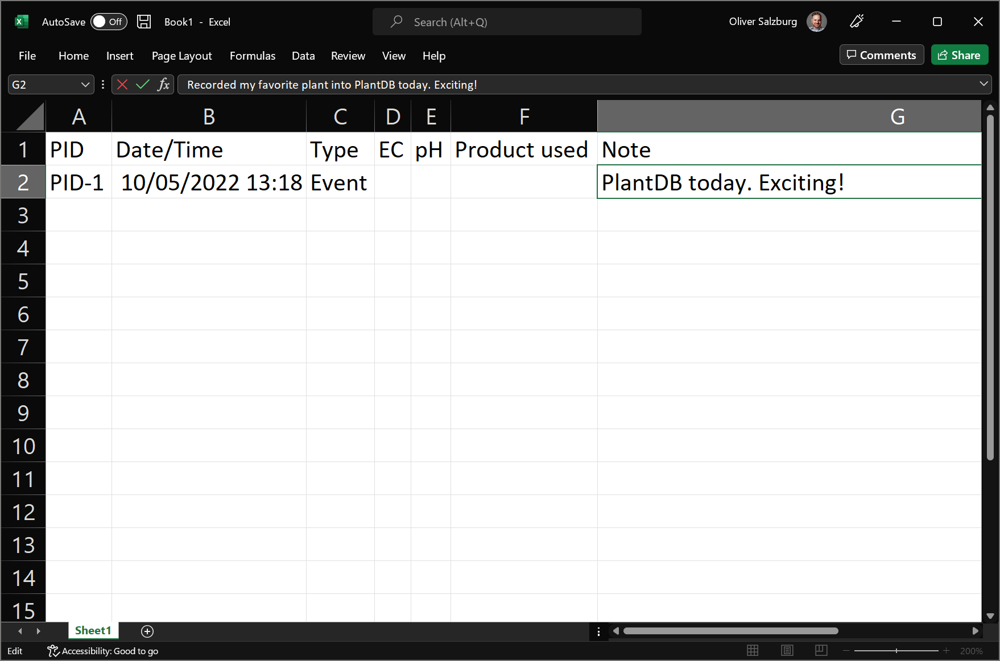

# Getting Started for Users

1.  Create a new workbook in your favorite spreadsheet application.

    

1.  Now add all the default columns that go into a PlantDB record log. Which are:

    -   PID
    -   Date/Time
    -   Type
    -   EC
    -   pH
    -   Product used
    -   Note

    !!! danger

        PlantDB is still in early developement. These are subject to change.

    Your sheet should now look something like this:

    

1.  Pick any of your plants. This is now the first plant you will take a record of. The first plant in your log will be `PID-1`. So put that in the first column under **PID** (cell `A2`).

    For the **Date/Time**, that would be _right now_. So enter the current date and time into cell `B2`.

    !!! hint

        If you're using Microsoft Excel, you can use <kbd>Ctrl</kbd> + <kbd>;</kbd> and <kbd>Ctrl</kbd> + <kbd>Shift</kbd> + <kbd>;</kbd> as a series of keystrokes to have the current date and time entered into the cell.

        <small>Don't forget to add a space in between.</small>

    The **Type** would be the type of event this is. The easiest is to not think too much about it right now and just enter `Event` into cell `C2`.

1.  The **EC**, **pH**, and **Product used** values can be safely ignored for now. Leave them empty.

1.  Last, but certainly not least, enter a note about this event. You could write:

    > Recorded my favorite plant into PlantDB today. Exciting!

    

1.  That's it! You now have a PlantDB-complient record log of your plant data. Keep on doing this for a while, try to remember old information, and extend your log.

    When you have a reasonable amount of data recorded, it's time to [import it into the playground](/plantdb/playground).

    Right now, you might want to look at the [event types](../reference/Event%20types.md) that are commonly used with PlantDB.
