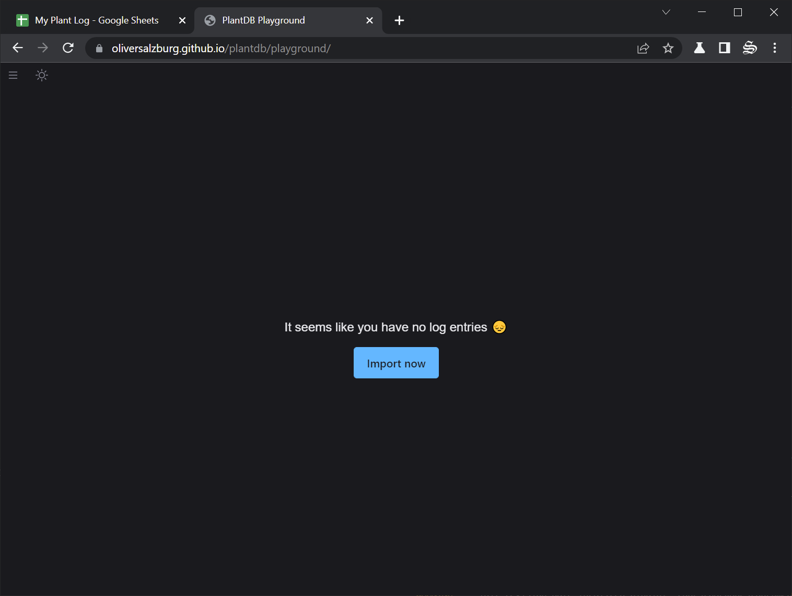

# The PlantDB Playground

Or "Playground" for short, is an example application of a plant care app that could be built on top of PlantDB data.

[Visit the PlantDB Playground](/plantdb/playground/){ .md-button }

## Introduction

When you first visit the playground, you'll like be greated by a message telling you that you have no data yet.

Follow the instructions to go to the **Import** page.

!!! tip

    With the little :material-menu: icon in the top left corner, you can open the sidebar and navigate between all sections of the application.
