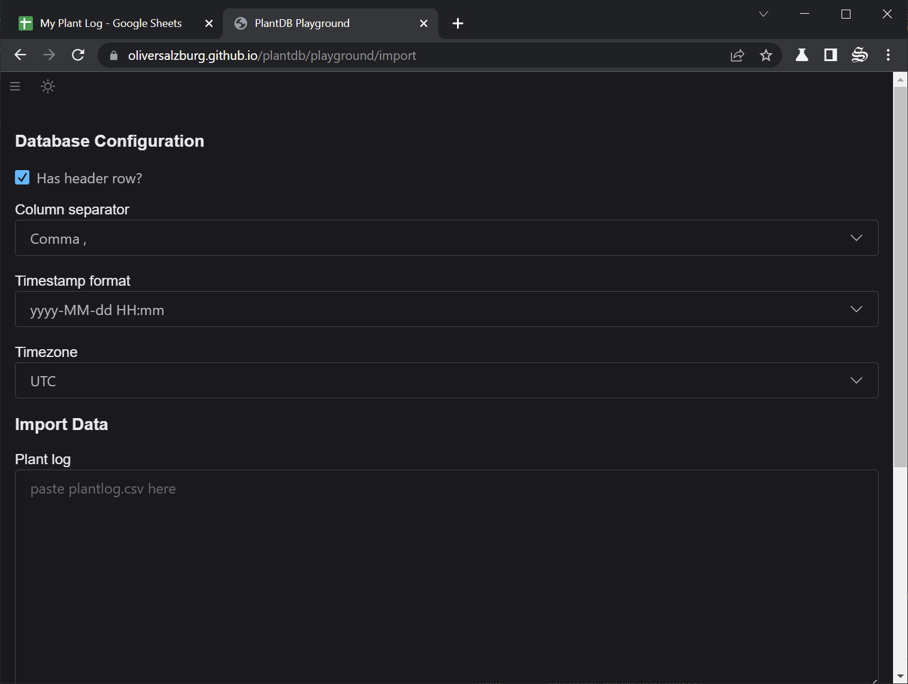
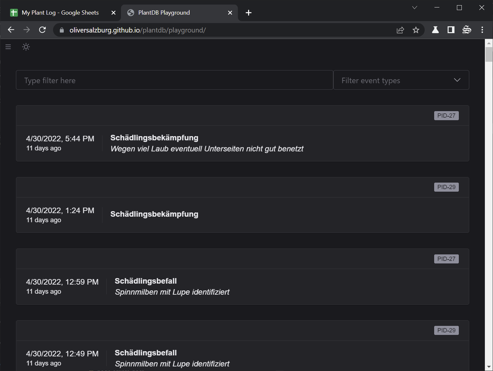

# The PlantDB Playground

Or "Playground" for short, is an example application of a plant care app that could be built on top of PlantDB data.

The Playground runs entirely in your browser and does not send any data anywhere.

[Visit the PlantDB Playground](/plantdb/playground/){ .md-button }

## Introduction

When you first visit the playground, you'll like be greeted by a message telling you that you have no data yet.

Follow the instructions to go to the **Import** page.

!!! tip

    With the little :material-menu: icon in the top left corner, you can open the sidebar and navigate between all sections of the application.

## Importing data

On the **Import** page, you're presented with a form asking you about your database format.

If these options don't instantly make sense to you, we'll look at them in the context of some exported data. An easy way to get data into the Playground, is to just copy and paste it from your spreadsheet application. For this example, I'll copy some log data from Google Sheets.

Now we just paste that into the box that's titled **Plant log**.

As I did copy the header row (which is highly recommended), I leave **Has header row?** checked.

The columns in my data here is separated with **tabs**. The most obvious give-away is the absence of commas and semicolons. So I would select **Tab** as the **Column separator** in the configuration.

The timestamp format here is an English date variant for Germany (`en-DE`). The **Timestamp format** I would select is `dd/MM/yyyy HH:mm`.

My **Timezone** is `Europe/Berlin`. If yours is not listed, `UTC` is usually a safe choice.

!!! bug

    If you can't find a matching option for your data, please [open an issue](https://github.com/oliversalzburg/plantdb/issues/new) about it on the PlantDB repository.

Ignore the **Plant data** box for now.

Press the **Import** button to import the data and then you can start exploring it.

## Success

You should now see the imported log.

