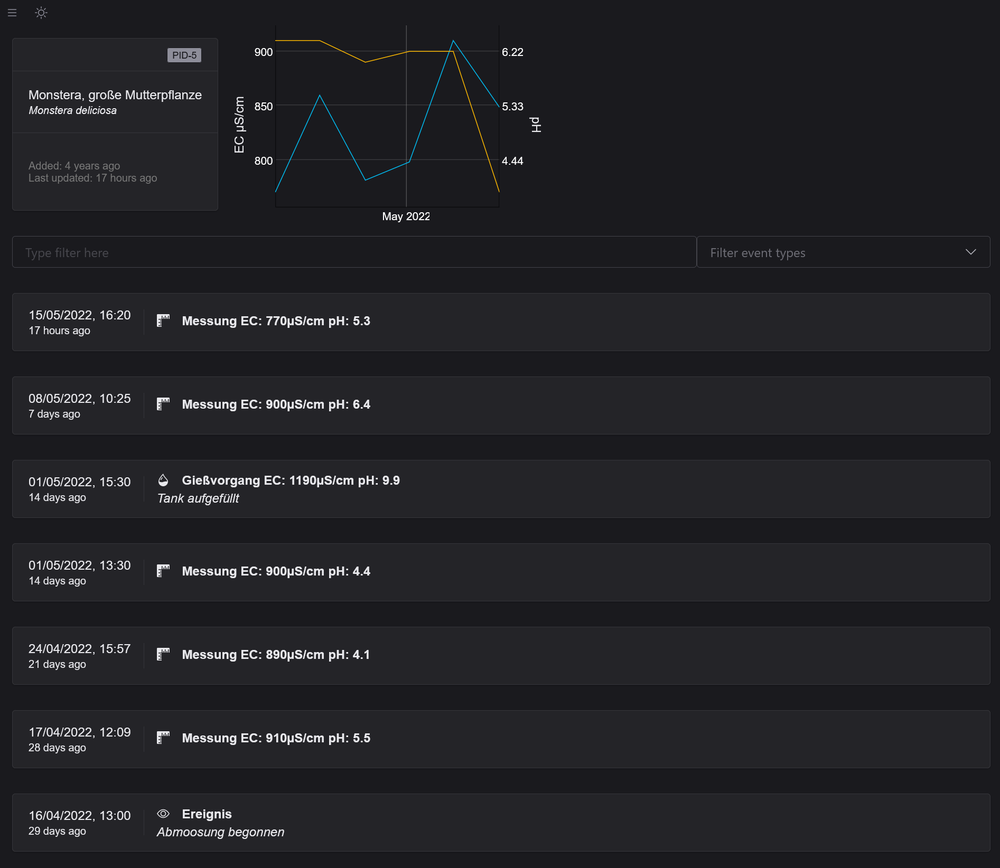
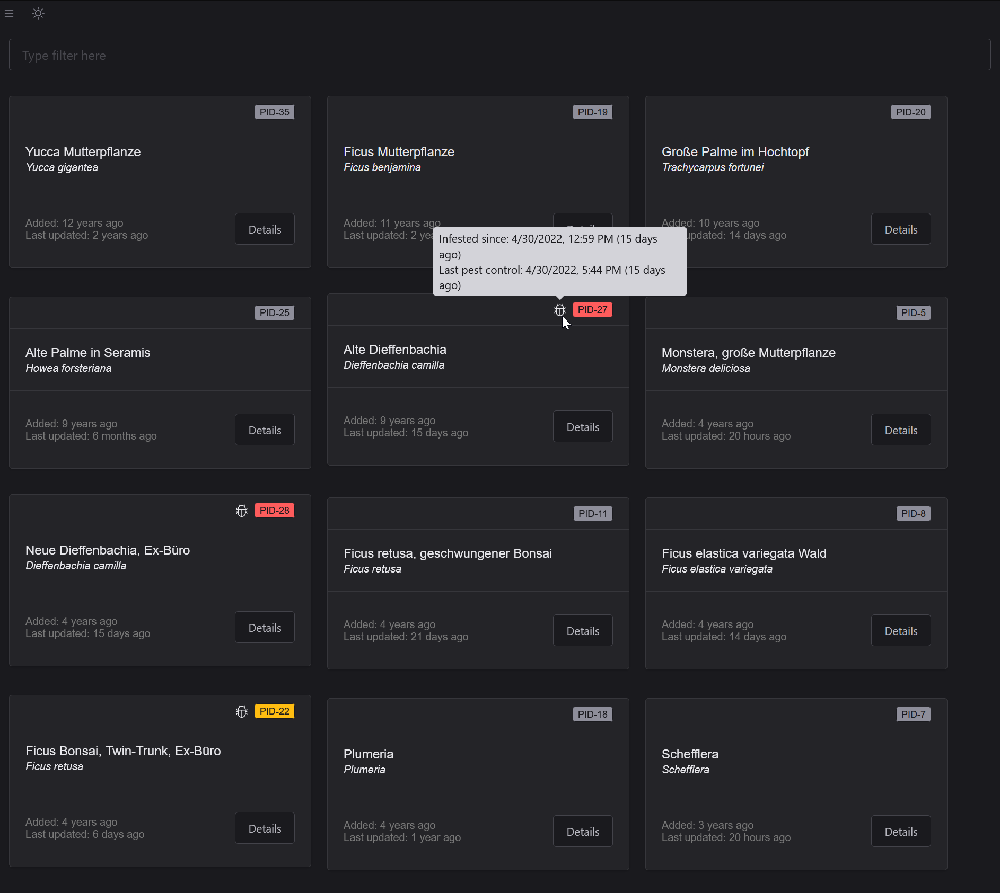

# PlantDB Playground

A progressive web application that allows to interact with PlantDB data.

The scope of this application is not clearly defined. For the time being, it serves as a place to develop PlantDB components and to mature the PlantDB specification.

## Screenshots

